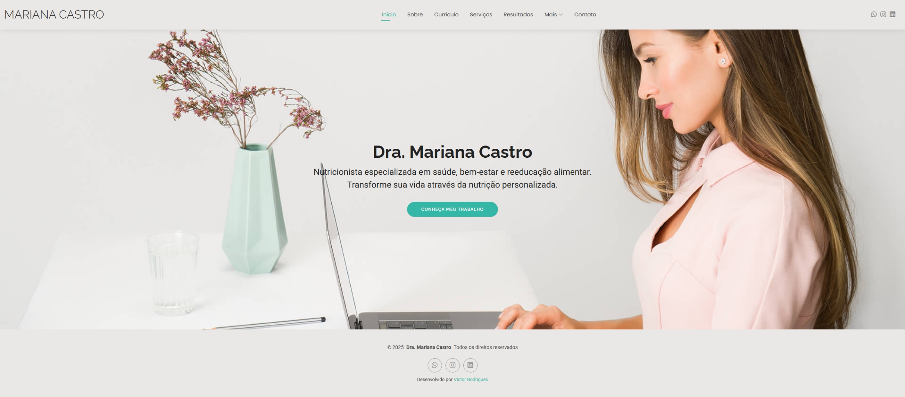

# 🌐 Portfólio - Dra. Mariana Castro  

Site desenvolvido para apresentar **os serviços, resultados, planos alimentares e informações profissionais** da **Dra. Mariana Castro**.  
O projeto foi construído com **HTML5**, **CSS3** e **Bootstrap**, complementado com bibliotecas modernas para garantir **animações, carrosséis e melhor experiência do usuário**.

## 🌐 Demonstração  

  
🔗 **Acesse o site:** [https://victormelkor.github.io/marianacastro](https://victormelkor.github.io/marianacastro)  

---

## 🚀 Tecnologias Utilizadas  

  
  
  
  

- **AOS (Animate On Scroll)** – animações ao rolar a página  
- **Swiper.js** – carrosséis responsivos  
- **Glightbox** – exibição de imagens e vídeos em modal  
- **Waypoints** – disparo de animações ao atingir seções  
- **PureCounter** – contadores animados  
- **Isotope Layout** – filtros e organização de elementos  
- **ImagesLoaded** – carregamento otimizado de imagens  

---

## 🎯 Funcionalidades  

- Página inicial com informações principais  
- Seções de **serviços**, **resultados** e **planos alimentares**  
- Menu de navegação responsivo e otimizado para dispositivos móveis  
- Integração com redes sociais  
- Animações e interatividade para melhor UX  

---

## 📄 Licença  

Este projeto está sob a licença MIT. Consulte o arquivo [LICENSE](./LICENSE) para mais detalhes.  

---

## 🧑‍💻 Autor

  
  
  
  
  

